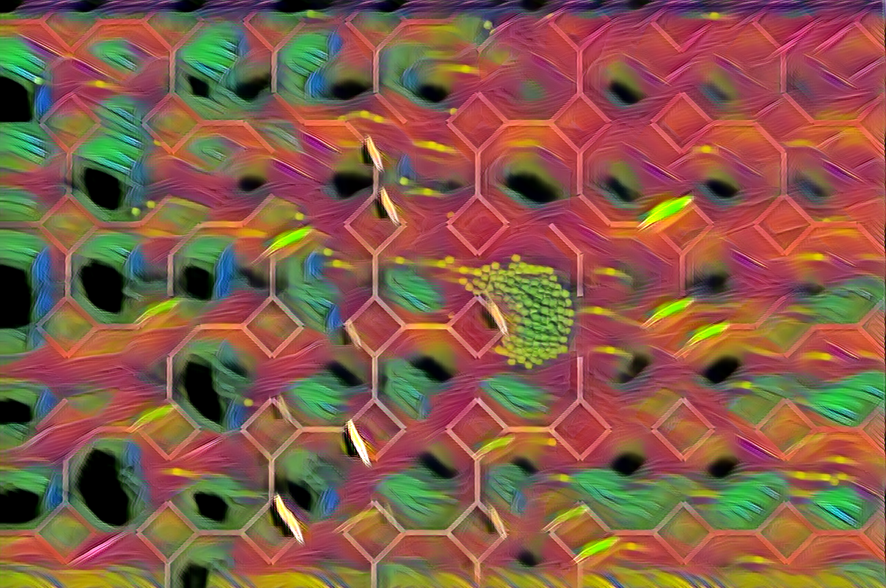

## Jupyter wrapper of [fast-neural-style](https://github.com/pytorch/examples/tree/main/fast_neural_style) example with ONNX converting and a test web app

## Try it out
[https://onnx-style-transfer.netlify.app/](https://onnx-style-transfer.netlify.app/)

It works on 720p-ish PNGs, not sure why it's not working on larger resolutions yet as the buffers are dynamic, and the file format should not matter but that's where it is atm.

Original with explanation on usage:
https://github.com/pytorch/examples/tree/main/fast_neural_style

## Install dependencies

pip install -r requirements.txt

## Get or create a dataset.

Create a folder and subfolder `train/classes` to place all of your training images. The program won't recognize it unless it's under a `classes` subfolder. 

The first images we used were from the recommended COCO 2014 dataset from the original example: https://cocodataset.org/#download

The `--style-image` defined in [`train.ipynb`](./train.ipynb) is your reference photo. You can use drawings for example, like we did, to adopt its look and feel.

The neural network will freeze this style in its memory to be able to rapidly reconstruct an image based on an input. It is supposed to be able to perform super resolution on a compressed result as well to speed up the time which we are figuring out out how to configure.

## Train

In `train.ipynb`, adjust these parameters as needed:
```py

dataset_path = "train"
style_image_path = "test/capture.png"
save_model_dir = "test"
model_name = "model.onnx"
output_image = "test/output.png"

command = [
    ...
    "--style-weight", "1e11",
    "--content-weight", "1e5",
    "--epochs", "2",
    "--cuda", "1"
]
```
Setting cuda to 0 will force CPU training, which is much slower on a large dataset. Our RTX3070 took 2 hours 20 minutes to train on COCO2014, an 18gb dataset. Speed will vary based on that size.

If using Mac, see neural_style.py for appropriate commands, uncomment the lines for `args.mps` in neural_style.py (this caused errors on Windows for us in Python 3.11 for whatever reason) and supply the appropriate command in the array according to the [original repository instructions]((https://github.com/pytorch/examples/tree/main/fast_neural_style))

Run `train.ipynb` and let it finish. 

## Convert

Run `convert.ipynb` to convert the outputted `model.pth` file for Pytorch to a `model.onnx` file for ONNX runtimes using the supplied parameters. We're working on fixing this for `onnxruntime-web` gpu operations. It works in python.

## Test

Tweak parameters as needed:

```py

# Define your paths and options here
style_image_path = "test/capture.png"
save_model_dir = "test"
model_name = "model.onnx"
output_image = "test/output2.png"

command2 = [
    "python", "neural_style.py", "eval",
    "--content-image", style_image_path,
    "--model", save_model_dir+"/"+model_name,
    "--output-image", output_image,
    "--cuda", "1"
]

```

Run `test.ipynb`

I am just testing this to see how real-time capable it is for styling a game as a hack, so for example I can feed the frames of a recording in from a game to give the classifier enough context to perform the shader pass.

In:


Out:


## Run the webapp

Copy the `model.onnx` result you created to testapp/models. Follow the [README](./testapp/README.md) in that subfolder to run the sample. 

We'll be working on optimizing it and seeing if we can get a 30-60fps result. 


