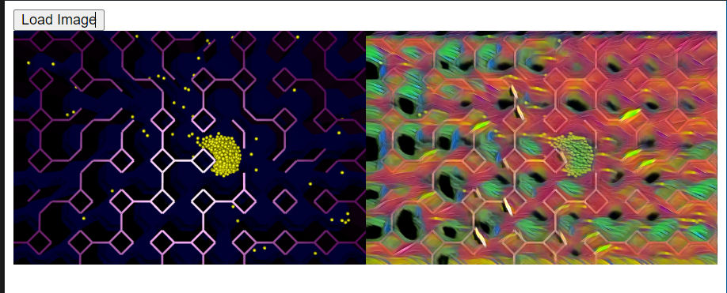
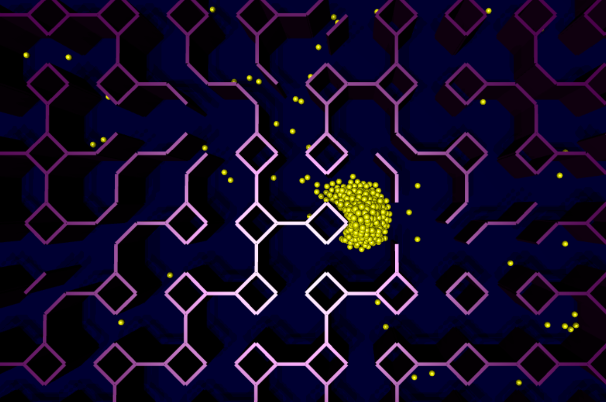
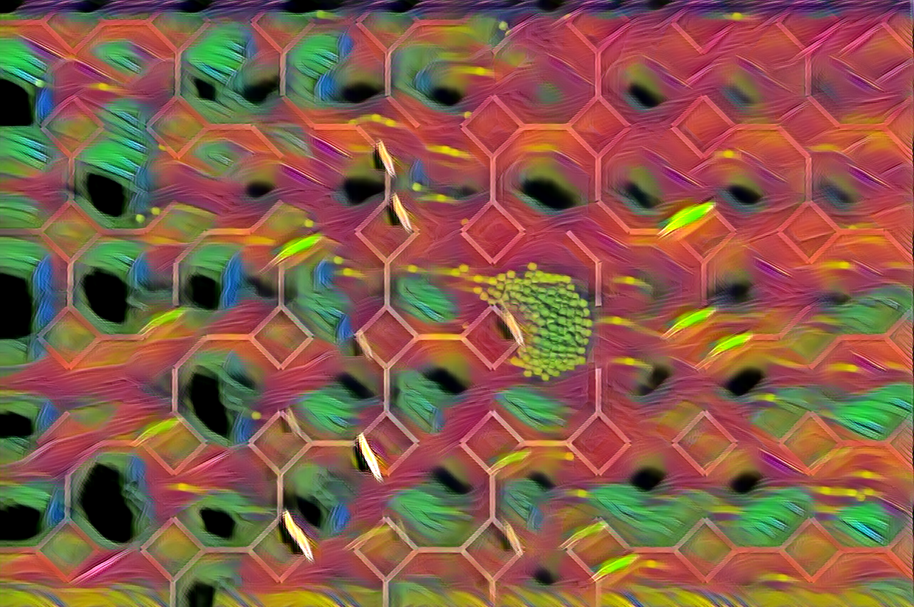
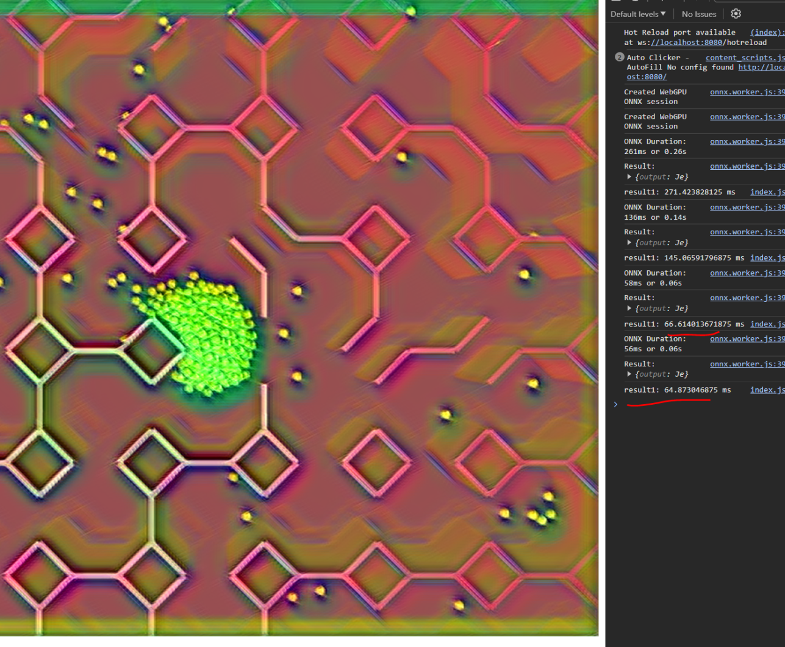
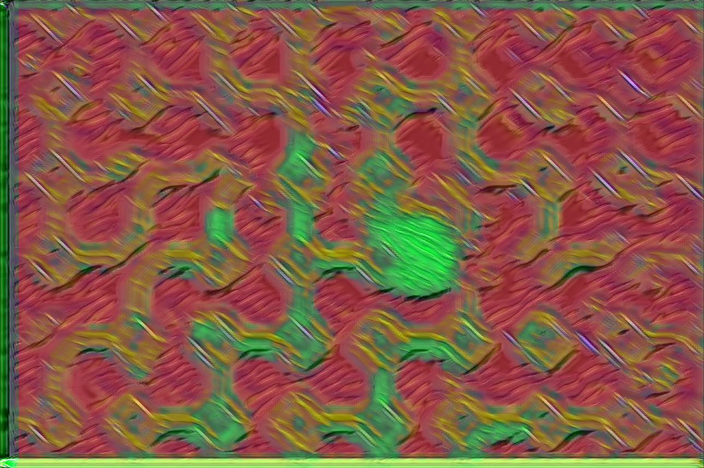

## Jupyter wrapper of [fast-neural-style](https://github.com/pytorch/examples/tree/main/fast_neural_style) example with ONNX converting and a test web app



## Try it out
[https://onnx-style-transfer.netlify.app/](https://onnx-style-transfer.netlify.app/)

It works on 720p-ish PNGs, not sure why it's not working on larger resolutions yet as the buffers are dynamic, and the file format should not matter but that's where it is atm.

Original with explanation on usage:
https://github.com/pytorch/examples/tree/main/fast_neural_style

Additional tweaks based on work for real time Unity and Mobile development done here:

https://blog.unity.com/engine-platform/real-time-style-transfer-in-unity-using-deep-neural-networks

and here:

https://medium.com/@jamesonthecrow/creating-a-17kb-style-transfer-model-with-layer-pruning-and-quantization-864d7cc53693


## Install dependencies

pip install -r requirements.txt

## Get or create a dataset.

Create a folder and subfolder `train/classes` to place all of your training images. The program won't recognize it unless it's under a `classes` subfolder. 

The first images we used were from the recommended COCO 2014 dataset from the original example: https://cocodataset.org/#download

The `--style-image` defined in [`train.ipynb`](./train.ipynb) is your reference photo. You can use drawings for example, like we did, to adopt its look and feel.

The neural network will freeze this style in its memory to be able to rapidly reconstruct an image based on an input. It is supposed to be able to perform super resolution on a compressed result as well to speed up the time which we are figuring out how to configure.

## Train

In `train.ipynb`, adjust these parameters as needed:
```py

dataset_path = "train"
style_image_path = "test/capture.png"
save_model_dir = "test"
model_name = "model.onnx"
output_image = "test/output.png"

command = [
    ...
    "--style-weight", "1e11",
    "--content-weight", "1e5",
    "--epochs", "2",
    "--cuda", "1"
]
```
Setting cuda to 0 will force CPU training, which is much slower on a large dataset. Our RTX3070 took 2 hours 20 minutes to train on COCO2014, an 18gb dataset. Speed will vary based on that size.

If using Mac, see neural_style.py for appropriate commands, uncomment the lines for `args.mps` in neural_style.py (this caused errors on Windows for us in Python 3.11 for whatever reason) and supply the appropriate command in the array according to the [original repository instructions]((https://github.com/pytorch/examples/tree/main/fast_neural_style))

Run `train.ipynb` and let it finish. 

For example we used a still from the movie Mind Game directed by Masaaki Yuasa, which you should go watch right now.


## Convert

Run `convert.ipynb` to convert the outputted `model.pth` file for Pytorch to a `model.onnx` file for ONNX runtimes using the supplied parameters. We're working on fixing this for `onnxruntime-web` gpu operations. It works in python.

You can also test the .pth file version first before converting, if you use model_name = "model.pth" in the Test.ipynb as shown below.

## Test

Tweak parameters as needed:

```py

# Define your paths and options here
style_image_path = "test/capture.png"
save_model_dir = "test"
model_name = "model.onnx"
output_image = "test/output2.png"

command2 = [
    "python", "neural_style.py", "eval",
    "--content-image", style_image_path,
    "--model", save_model_dir+"/"+model_name,
    "--output-image", output_image,
    "--cuda", "1"
]

```

Run `test.ipynb`

I am just testing this to see how real-time capable it is for styling a game as a hack, so for example I can feed the frames of a recording in from a game to give the classifier enough context to perform the shader pass.

In:


Out:


Nice result but this was on the 128 channel model, which only ran around 3fps on our RTX3070 at 720p on the WebGPU ONNX backend via browser. That's a 7Mb model. We tweaked it and optimized the layer computations and got it down to 41kb without quantizing properly, so we should be able to get much more out of it.

Note the style weight on the smaller model is more finicky so we're tuning it still. You want it pretty high on the large model, we used 1e11, while somewhere between 1e10 and 5e10 is the right setting for the small model. We'll get it!

Too low, does a good reconstruction still:


Too high, can't see the scene:


The border distortions are because of our padding not being totally correct.

We were able to get 16-20fps at 720p on our mobile version of the model. We're still looking for ways to advance it.

## Run the webapp

Copy the `model.onnx` result you created to testapp/models. Follow the [README](./testapp/README.md) in that subfolder to run the sample. 

We'll be working on optimizing it and seeing if we can get a 30-60fps result. 


## Our Model of Choice (wip)

We switched all convolutions to Depthwise Separable convolution which should be about 100x less computations, and lowered the number of filters to 9 based on recommendations found online. The resulting model without proper quantization is 41kb, and runs at 16-20fps at 720p on an RTX3070 on the WebGPU ONNX distribution. You can find the .pth or .onnx files in the test/ folder. This should definitely run faster than it does on our hardware.

Note padding shouldn't actually be zero below as it causes artifacts, it's a bug we're fixing.
```py   
# Architecture based on: https://medium.com/@jamesonthecrow/creating-a-17kb-style-transfer-model-with-layer-pruning-and-quantization-864d7cc53693
class EfficientMobileTransformerNet(torch.nn.Module):
    def __init__(self):
        super(EfficientMobileTransformerNet, self).__init__()
        # Initial convolution layers with less complexity and efficient design
        self.conv1 = DepthwiseConvLayer(3, 9, kernel_size=9, stride=1, padding=0)
        self.in1 = torch.nn.InstanceNorm2d(9, affine=True)
        self.conv2 = DepthwiseConvLayer(9, 9, kernel_size=3, stride=2, padding=0)
        self.in2 = torch.nn.InstanceNorm2d(9, affine=True)
        self.conv3 = DepthwiseConvLayer(9, 9, kernel_size=3, stride=2, padding=0)
        self.in3 = torch.nn.InstanceNorm2d(9, affine=True)

        # A single, more efficient residual block
        self.resblocks = torch.nn.Sequential(*[OptimizedResidualBlock(9) for _ in range(3)])

        # Upsampling Layers with efficient techniques
        self.deconv1 = DepthwiseConvLayer(9, 9, kernel_size=3, stride=1, upsample=2, padding=0) #upsample=4
        self.in4 = torch.nn.InstanceNorm2d(9, affine=True)
        self.deconv2 = DepthwiseConvLayer(9, 9, kernel_size=9, stride=1, upsample=2, padding=0) #OptimizedUpsampleConvLayer
        self.in5 = torch.nn.InstanceNorm2d(9, affine=True)
        self.deconv3 = DepthwiseConvLayer(9, 3, kernel_size=3, stride=1, padding=0)
       
        # Non-linearities
        # ReLU (Rectified Linear Unit) introduces non-linearity, helping the network learn complex patterns.
        self.relu = torch.nn.ReLU()

    def forward(self, X):
        # Define the forward pass through the network.
        
        # Applies convolutional layers, residual blocks, and upsampling layers in sequence.
        y = self.relu(self.in1(self.conv1(X)))
        y = self.relu(self.in2(self.conv2(y)))
        y = self.relu(self.in3(self.conv3(y)))
        
        # Residual blocks do not change the dimensions of their input.
        y = self.resblocks(y)
        
        # Upsampling layers increase the spatial dimensions of the input.
        y = self.relu(self.in4(self.deconv1(y)))
        y = self.relu(self.in5(self.deconv2(y)))
        y = self.deconv3(y)  # Final convolution to produce the output.
        return y

```


## HELP

I'm sharing all results free and making it instructional via these ipynb files as ONNX etc is a bit esoteric but also the cutting edge right now for distributing these kinds of programs. We can make universal shader systems this way, halp me fix bugs and whittle this down to real time capable at least on desktop, probably on mobile too. 